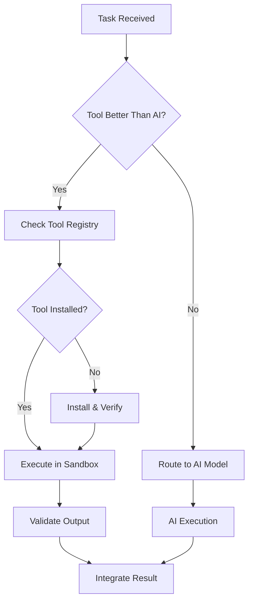

# ARCHON Architecture

## System Overview

ARCHON is a distributed AI engineering operating system with the following core subsystems:

### 1. Manager (Orchestration Layer)

The Manager is the central intelligence that:
- Never writes code directly
- Routes tasks to optimal AI models or external tools
- Maintains global project state
- Arbitrates conflicts between agents
- Enforces quality gates
- Learns from past decisions

**Key Responsibilities:**
```
┌─────────────────────────────────────────────────────────┐
│ MANAGER CORE FUNCTIONS                                  │
├─────────────────────────────────────────────────────────┤
│ • Task DAG Construction & Scheduling                    │
│ • Model Selection (GPT-4 vs Claude vs Gemini)          │
│ • Tool vs AI Decision Engine                            │
│ • File Ownership & Conflict Resolution                  │
│ • Architecture Drift Detection                          │
│ • Quality Gate Enforcement                              │
│ • Cross-Project Learning                                │
└─────────────────────────────────────────────────────────┘
```

### 2. Model Routing Engine

Routes tasks to optimal AI model based on:

| Task Type | Primary Model | Reasoning |
|-----------|--------------|-----------|
| Frontend Creative UI | Gemini 2.0 Flash | Fast iteration, visual understanding |
| Deep Reasoning | GPT-4 | Complex logic, architectural decisions |
| Security Review | Claude Opus | Safety-focused, thorough analysis |
| Large Context Refactor | Claude Opus | 200K context window |
| Fast Prototyping | Gemini Flash | Speed + cost efficiency |

**Selection Criteria:**
```python
ModelSelectionCriteria = {
    "task_complexity": float,      # 0.0 - 1.0
    "reasoning_depth": float,      # 0.0 - 1.0
    "context_size": int,           # tokens required
    "speed_priority": float,       # 0.0 - 1.0
    "cost_constraint": float,      # max cost per task
    "historical_performance": float # learned metric
}
```

### 3. Tool Orchestration System

**Critical Innovation**: Manager can choose external CLI tools when superior to AI models.

**Decision Flow:**


**Tool Registry Schema:**
```json
{
  "tool_name": "eraser-cli",
  "task_types_supported": ["system_design_diagram", "architecture_diagram"],
  "installation_method": "npm install -g eraser-cli",
  "sandbox_required": true,
  "trust_score": 0.95,
  "performance_score": 0.92,
  "avg_execution_time_ms": 1500,
  "success_rate": 0.98,
  "last_used": "2026-02-15T10:00:00Z"
}
```

### 4. Agent System

**Specialized Agents:**

| Agent | Responsibility | Primary Model | Tool Fallbacks |
|-------|---------------|---------------|----------------|
| Backend | API, DB, business logic | GPT-4 | - |
| Frontend | UI/UX, components | Gemini Flash | Figma CLI |
| DevOps | Infrastructure, CI/CD | Claude | Terraform, Pulumi |
| Security | Vulnerability analysis | Claude Opus | Snyk, Semgrep |
| Testing | Test generation, E2E | GPT-4 | Playwright |
| Integration | API contracts, schemas | GPT-4 | OpenAPI tools |
| Documentation | Docs, diagrams | Gemini | Eraser, Mermaid |
| Git | Version control, PRs | GPT-4 | - |

**Agent Communication Protocol:**
```typescript
interface AgentTask {
  task_id: string;
  agent_type: AgentType;
  assigned_model: ModelType;
  task_description: string;
  context: ProjectContext;
  constraints: Constraints;
  quality_threshold: number;
}

interface AgentResponse {
  task_id: string;
  status: "success" | "failure" | "needs_deliberation";
  output: StructuredOutput;
  files_modified: FileChange[];
  quality_score: number;
  execution_time_ms: number;
  model_used: ModelType;
  tool_used?: string;
}
```

### 5. Deliberation Protocol

When conflicts arise (e.g., Backend agent wants microservices, Frontend agent wants monolith):

**Structured Deliberation:**
```json
{
  "conflict_id": "uuid",
  "conflict_type": "architectural_decision",
  "agents_involved": ["backend", "frontend", "devops"],
  "proposals": [
    {
      "agent": "backend",
      "proposal": "microservices_architecture",
      "reasoning": "scalability, team autonomy",
      "risk_score": 0.6,
      "complexity_score": 0.8
    },
    {
      "agent": "frontend",
      "proposal": "monolith_with_modular_frontend",
      "reasoning": "faster iteration, simpler deployment",
      "risk_score": 0.3,
      "complexity_score": 0.4
    }
  ],
  "manager_decision": {
    "chosen_proposal": "monolith_with_modular_frontend",
    "reasoning": "project_phase=mvp, team_size=small, speed>scale",
    "override_conditions": "if users > 10k, revisit architecture"
  }
}
```

### 6. Persistence Layer

**Directory Structure:**
```
.archon/
├── project.db              # SQLite: tasks, agents, files
├── task_graph.json         # DAG of all tasks
├── file_map.json           # File ownership & history
├── architecture_map.json   # System architecture state
├── risk_map.json           # Risk registry
├── agent_metrics.json      # Performance tracking
├── tool_registry.json      # External tool catalog
├── tool_usage_log.json     # Tool execution history
├── project_dna.json        # Project fingerprint
├── memory.vec              # Vector embeddings for RAG
└── agent_logs/
    ├── backend/
    ├── frontend/
    └── manager/
```

**Database Schema:**
```sql
-- Tasks
CREATE TABLE tasks (
    task_id TEXT PRIMARY KEY,
    parent_task_id TEXT,
    agent_type TEXT,
    model_assigned TEXT,
    tool_used TEXT,
    status TEXT,
    quality_score REAL,
    created_at TIMESTAMP,
    completed_at TIMESTAMP
);

-- Files
CREATE TABLE files (
    file_path TEXT PRIMARY KEY,
    owner_agent TEXT,
    last_modified_by TEXT,
    last_modified_at TIMESTAMP,
    lines_of_code INTEGER,
    complexity_score REAL
);

-- Decisions
CREATE TABLE decisions (
    decision_id TEXT PRIMARY KEY,
    decision_type TEXT,
    agents_involved TEXT,
    chosen_option TEXT,
    reasoning TEXT,
    timestamp TIMESTAMP
);
```

### 7. Code Intelligence Layer

**Capabilities:**
- AST parsing (Tree-sitter)
- Dependency graph analysis
- Circular dependency detection
- Coupling metrics (afferent/efferent)
- Architectural drift detection
- Static analysis integration

**Drift Detection:**
```python
class ArchitectureDriftDetector:
    def detect_drift(self, current_state, architecture_map):
        """
        Detects when implementation diverges from architecture.
        
        Examples:
        - New dependencies not in architecture_map
        - Coupling violations (frontend importing backend internals)
        - Layer violations (data layer calling presentation layer)
        """
        violations = []
        
        # Check dependency violations
        for file in current_state.files:
            expected_deps = architecture_map.get_allowed_deps(file)
            actual_deps = self.parse_imports(file)
            
            forbidden = actual_deps - expected_deps
            if forbidden:
                violations.append({
                    "type": "forbidden_dependency",
                    "file": file,
                    "forbidden_imports": list(forbidden)
                })
        
        return violations
```

### 8. Simulation & Chaos Engineering

**Scale Simulation:**
```bash
archon simulate "scale to 1M users"
```

Manager:
1. Analyzes current architecture
2. Identifies bottlenecks (DB queries, API endpoints)
3. Assigns remediation tasks to agents
4. Proposes infrastructure changes

**Chaos Testing:**
```bash
archon chaos test
```

Injects failures:
- Database connection loss
- API rate limiting
- Memory pressure
- Network partitions

### 9. Cross-Project Learning

**Learning Metrics:**
```json
{
  "task_type": "authentication_implementation",
  "best_performing_model": {
    "model": "gpt-4",
    "avg_quality_score": 0.94,
    "avg_time_ms": 45000,
    "success_rate": 0.97
  },
  "best_performing_tool": null,
  "common_failure_patterns": [
    "jwt_expiry_not_handled",
    "refresh_token_rotation_missing"
  ],
  "recommended_approach": "use_passport_js_with_jwt_strategy"
}
```

### 10. Security Model

**Sandbox Execution:**
```typescript
class ToolSandbox {
  async execute(tool: ExternalTool, input: ToolInput): Promise<ToolOutput> {
    // Create isolated environment
    const sandbox = await this.createSandbox({
      network: "isolated",
      filesystem: "read-only-except-project-dir",
      max_memory: "512MB",
      max_cpu: "50%",
      timeout: "5m"
    });
    
    // Execute tool
    const result = await sandbox.run(tool.command, input);
    
    // Validate output
    const validation = await this.validateOutput(result, tool.schema);
    
    // Log execution
    await this.logExecution({
      tool: tool.name,
      input_hash: hash(input),
      output_hash: hash(result),
      validation_status: validation.status,
      timestamp: Date.now()
    });
    
    return result;
  }
}
```

## System Guarantees

1. **Auditability**: Every decision is logged with reasoning
2. **Reproducibility**: Same input → same output (deterministic routing)
3. **Safety**: All external tools run in sandbox
4. **Quality**: Enforced quality gates before merge
5. **Learning**: Performance improves over time

## Performance Targets

- Task routing decision: < 100ms
- Agent task assignment: < 500ms
- Quality gate validation: < 2s
- Cross-project learning update: < 1s

## Next Steps

See [IMPLEMENTATION.md](./IMPLEMENTATION.md) for scaffolding details.
